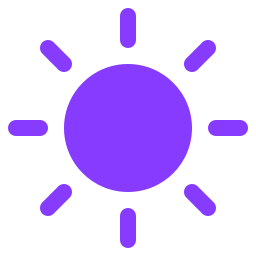

<div align="center">



# weer

A minimal weather app — search any place, get a 8-day forecast.

[weer.vlad.studio](https://weer.vlad.studio)

</div>

## Features

- **Search** any location worldwide (Open-Meteo geocoding)
- **Current conditions** — temperature, wind, precipitation, day/night
- **Hourly + 8-day forecast** — temp, weather, wind, rain, UV index
- **Recents** — last 10 locations, stored in `localStorage`
- **Shareable URLs** — location lives in the query string (`?loc=5128581`)
- **PWA-ready** — manifest + icons, installable

## Stack

- [React 19](https://react.dev) + [Vite](https://vite.dev) + TypeScript
- [Open-Meteo](https://open-meteo.com) geocoding — free, no key needed
- [Pirate Weather](https://pirateweather.net) — free weather API (Dark Sky-compatible), key required
- [nuqs](https://nuqs.47ng.com) — URL query state
- [Phosphor Icons](https://phosphoricons.com)

## Development

```bash
bun install
bun run dev      # start dev server
bun run build    # type-check + production build
bun run lint     # oxlint
bun run fmt      # oxfmt
```
